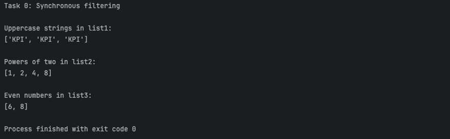

[🏠 Home Page](../) | [📝 Lab 0](../lab0/) | [📝 Lab 1](../lab1/) | [📝 Lab 2](../lab2/) | [📝 Lab 3](../lab3/) | [📝 Lab 4](../lab4/) | [📝 Lab 5](../lab5/)

# Lab 0: Example use cases for synchronous filter function
## Implementation:

### [lab0.py](../lab0/lab0.py)
Demonstrates a synchronous implementation of a filter function with example cases such as filtering uppercase strings, powers of two, and even numbers.
```python
def sync_filter(func, arr):
    return [item for item in arr if func(item)]

def is_upper(word):
    return isinstance(word, str) and word.isupper()

def is_two_power(num):
    if not isinstance(num, int) or num <= 0:
        return False
    return (num & (num - 1)) == 0

def is_even(num):
    return isinstance(num, int) and num % 2 == 0

def main():
    list1 = ['KPI', 'Kpi', 2, 'KPI', 'kpI', (3, 4), 'kPi', 'KPI']
    list2 = [-1, 0, 1, 'e', 2, 3, 4, 5, 6, 7, 'b', 8, 9, 10]
    list3 = [3, 5, 6, (3, 'e'), 8]

    print("Task 0: Synchronous filtering")
    print("\nUppercase strings in list1:")
    print(sync_filter(is_upper, list1))

    print("\nPowers of two in list2:")
    print(sync_filter(is_two_power, list2))

    print("\nEven numbers in list3:")
    print(sync_filter(is_even, list3))

if __name__ == "__main__":
    main()
```

## Testing program

### lab0.py

