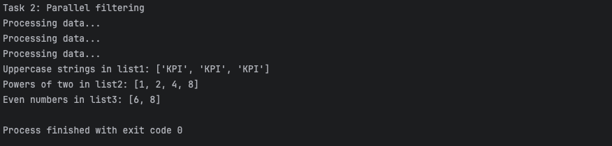

[🏠 Home Page](../) | [📝 Lab 0](../lab0/) | [📝 Lab 1](../lab1/) | [📝 Lab 2](../lab2/) | [📝 Lab 3](../lab3/) | [📝 Lab 4](../lab4/) | [📝 Lab 5](../lab5/)

# Lab 2: Async-Await alternative
## Description:
In this lab, you need to implement an alternative for asynchronous functions using async-await.
## Implementation:

### [lab2.py](./lab2.py): Implementation of the solution based on async-await.
Implements parallel filtering using `asyncio.gather`. Demonstrates use cases for async/await patterns.
```python
import asyncio

async def parallel_filter(func, arr):
    print(f"Processing data...")
    tasks = [asyncio.create_task(func(item)) for item in arr]
    results = await asyncio.gather(*tasks)
    return [item for item, result in zip(arr, results) if result]

async def is_upper(word):
    await asyncio.sleep(0.1)
    return isinstance(word, str) and word.isupper()

async def is_two_power(num):
    await asyncio.sleep(0.2)
    if not isinstance(num, int) or num <= 0:
        return False
    return (num & (num - 1)) == 0

async def is_even(num):
    await asyncio.sleep(0.05)
    return isinstance(num, int) and num % 2 == 0

async def main():
    list1 = ['KPI', 'Kpi', 2, 'KPI', 'kpI', (3, 4), 'kPi', 'KPI']
    list2 = [-1, 0, 1, 'e', 2, 3, 4, 5, 6, 7, 'b', 8, 9, 10]
    list3 = [3, 5, 6, (3, 'e'), 8]
    tasks = [
        asyncio.create_task(parallel_filter(is_upper, list1)),
        asyncio.create_task(parallel_filter(is_two_power, list2)),
        asyncio.create_task(parallel_filter(is_even, list3))
    ]
    results = await asyncio.gather(*tasks)
    print("Task 2: Parallel filtering")
    print("Uppercase strings in list1:", results[0])
    print("Powers of two in list2:", results[1])
    print("Even numbers in list3:", results[2])

if __name__ == "__main__":
    asyncio.run(main())
```

## Testing program

### lab2.py


