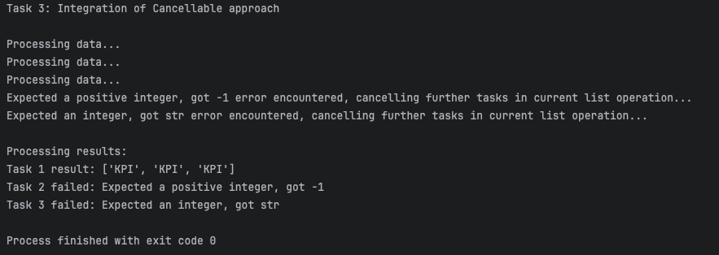

[🏠 Home Page](../) | [📝 Lab 1_2](../lab1_2/) | [📝 Lab 3](../lab3/) | [📝 Lab 4](../lab4/) | [📝 Lab 5](../lab5/) | [📝 Additional task](../additional-task/) 

# Lab 3: AbortController and Cancellation
## Description:
In this lab, you need to implement `AbortController` or other approach for canceling asynchronous operations.
## Implementation:

### [lab3.py](./lab3.py): Cancellation implementation.
Cancellable tasks using `asyncio.Event`. Handles task cancellation gracefully.
Includes error handling to manage unexpected exceptions.
```python
import asyncio

async def async_filter(func, arr, cancel_event):
    print("Processing data...")
    tasks = []
    for item in arr:
        if cancel_event.is_set():
            print("Cancel event detected. Stopping further tasks.")
            break
        task = asyncio.create_task(func(item))
        tasks.append((item, task))

    results = []
    for item, task in tasks:
        try:
            result = await task
            if result:
                results.append(item)
        except Exception as e:
            print(f"{e} error encountered, cancelling further tasks in current list operation...")
            cancel_event.set()
            for _, t in tasks:
                if not t.done():
                    t.cancel()
            await asyncio.gather(*[t for _, t in tasks], return_exceptions=True)
            raise
    return results

async def is_upper(word):
    await asyncio.sleep(0.1)
    if not isinstance(word, str):
        raise TypeError(f"Expected a string, got {type(word).__name__}")
    return word.isupper()

async def is_two_power(num):
    await asyncio.sleep(0.2)
    if not isinstance(num, int):
        raise TypeError(f"Expected an integer, got {type(num).__name__}")
    elif num <= 0:
        raise ValueError(f"Expected a positive integer, got {num}")
    return (num & (num - 1)) == 0

async def is_even(num):
    await asyncio.sleep(0.5)
    if not isinstance(num, int):
        raise TypeError(f"Expected an integer, got {type(num).__name__}")
    return num % 2 == 0

async def process_all_asynchronously(cancel_event):
    list1 = ['KPI', 'Kpi', 'KPI', 'kpI', 'kPi', 'KPI']
    list2 = [-1, 0, 1, 2, 3, 4, 5, 6, 7, 'b', 8, 9, 10]
    list3 = [3, 5, 6, 'e', 8]
    tasks = [
        asyncio.create_task(async_filter(is_upper, list1, cancel_event)),
        asyncio.create_task(async_filter(is_two_power, list2, cancel_event)),
        asyncio.create_task(async_filter(is_even, list3, cancel_event)),
    ]
    try:
        results = await asyncio.gather(*tasks, return_exceptions=True)
        print("\nProcessing results:")
        for i, result in enumerate(results, 1):
            if isinstance(result, Exception):
                print(f"Task {i} failed: {result}")
            else:
                print(f"Task {i} result: {result}")
    except asyncio.CancelledError:
        print("Tasks have been canceled.")

async def main():
    print("Task 3: Integration of Cancellable approach\n")
    cancel_event = asyncio.Event()
    task = asyncio.create_task(process_all_asynchronously(cancel_event))
    try:
        await asyncio.sleep(1.5)
        cancel_event.set()
        await task
    except asyncio.CancelledError:
        print("The main task has been canceled gracefully.")

if __name__ == "__main__":
    asyncio.run(main())
```

## Testing program

### lab3.py

